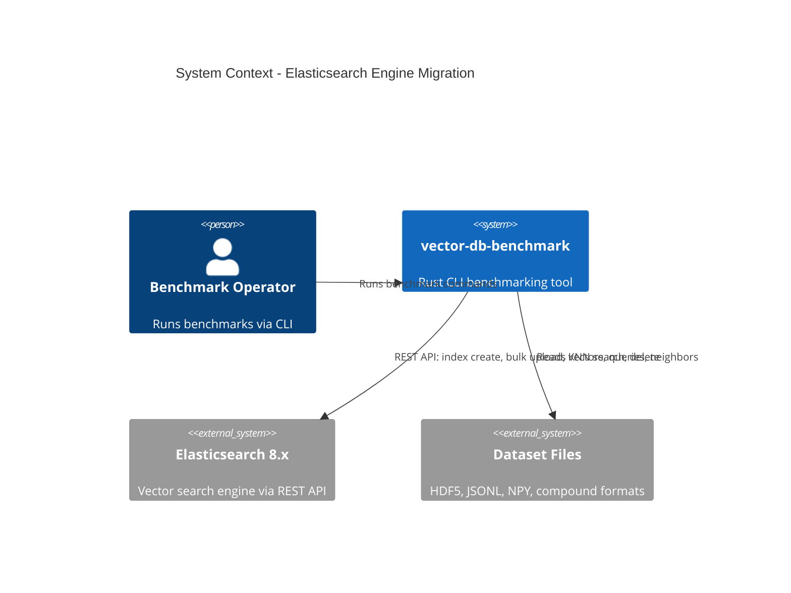

# Migrate Elasticsearch - System Context

## System Overview

Add Elasticsearch as a benchmark engine to the Rust vector-db-benchmark CLI. The engine connects to an Elasticsearch instance via REST API to create vector indices, upload vectors, and execute KNN searches.

## Context Diagram

## External Integrations

- **Elasticsearch 8.x**: Target vector database via REST API (port 9200). Operations: index management, bulk document upload, KNN vector search, force merge.
- **Dataset Files**: Local dataset files in HDF5/JSONL/NPY/compound formats providing vectors, queries, and ground truth neighbors.

## High-Level Constraints

- Must connect to Elasticsearch via HTTP REST (not transport protocol)
- Must use same index name convention as Python v0 (`bench` default)
- Must produce results JSON compatible with existing precision comparison tooling

## Key NFR Goals

- Search precision must match Python v0 for identical datasets and parameters
- Upload and search must support parallel execution via Rust threads
