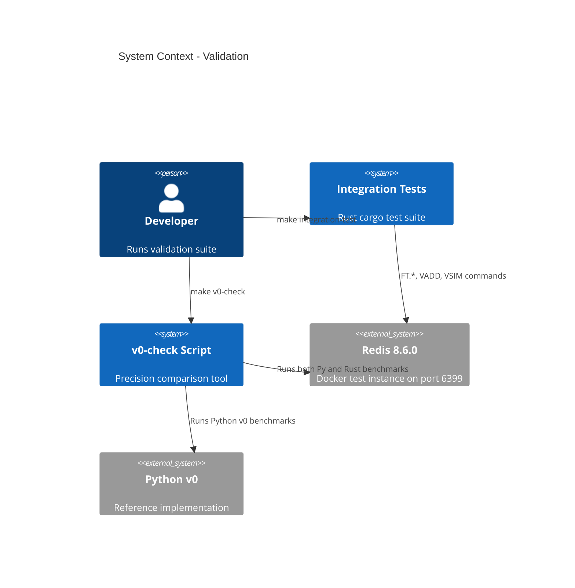

# Validate Redis & VectorSets - System Context

## System Overview

Validation intent — no new engine code. Extends test coverage and v0-check comparisons to confirm the existing Rust Redis and VectorSets engine implementations are correct.

## Context Diagram

## External Integrations

- **Redis 8.6.0**: Docker test container (port 6399) for integration tests
- **Python v0**: Reference implementation for precision comparison via v0-check

## High-Level Constraints

- No changes to engine implementation code
- Must use existing Docker test infrastructure
- v0-check requires Python v0 environment
